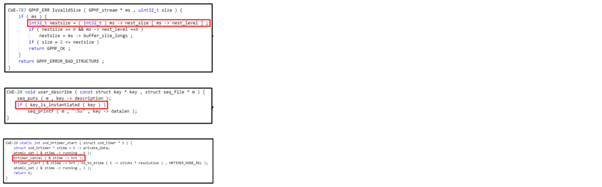

<div align="center">
  
# VulRepair Replication Package
  
</div>



<p align="center">
  </a>
  <h3 align="center"><a href="https://huggingface.co/MickyMike/VulRepair">VulRepair</a></h3>
  <p align="center">
    A T5-based Automated Software Vulnerability Repair
  </p>
</p>

<div align="center">

## Auto-Repair Real-World Software Vulnerabilities

</div>

<details open="open">
<summary></summary>

<h3>
    <b>
        <div align="center">
            VulRepair Performance on <a href="https://cwe.mitre.org/top25/archive/2021/2021_cwe_top25.html">Top-25 Most Dangerous CWEs in 2021</a>
        </div>
    </b>
</h3>
  
<div align="center">
    
| Rank | CWE Type |                     Name                     |  %PP | Proportion |
|:----:|:--------:|:--------------------------------------------:|:----:|:----------:|
|   1  |  CWE-787 |              Out-of-bounds Write             |  30% |    16/53   |
|   2  |  CWE-79  |             Cross-site Scripting             |   0  |     0/1    |
|   3  |  CWE-125 |              Out-of-bounds Read              |  32% |   54/170   |
|   4  |  CWE-20  |           Improper Input Validation          |  45% |   68/152   |
|   5  |  CWE-78  |             OS Command Injection             |  33% |     1/3    |
|   6  |  CWE-89  |                 SQL Injection                |  20% |     1/5    |
|   7  |  CWE-416 |                Use After Free                |  53% |    29/55   |
|   8  |  CWE-22  |                Path Traversal                |  25% |     2/8    |
|   9  |  CWE-352 |          Cross-Site Request Forgery          |   0  |     0/2    |
|  10  |  CWE-434 |              Dangerous File Type             |   -  |      -     |
|  11  |  CWE-306 | Missing Authentication for Critical Function |   -  |      -     |
|  12  |  CWE-190 |        Integer Overflow or Wraparound        |  53% |    31/59   |
|  13  |  CWE-502 |       Deserialization of Untrusted Data      |   -  |      -     |
|  14  |  CWE-287 |            Improper Authentication           |  50% |     3/6    |
|  15  |  CWE-476 |           NULL Pointer Dereference           |  66% |    46/70   |
|  16  |  CWE-798 |         Use of Hard-coded Credentials        |   -  |      -     |
|  17  |  CWE-119 |      Improper Restriction of Operations      |  37% |   141/386  |
|  18  |  CWE-862 |             Missing Authorization            |   0  |     0/2    |
|  19  |  CWE-276 |         Incorrect Default Permissions        |   -  |      -     |
|  20  |  CWE-200 |       Exposure of Sensitive Information      |  61% |    39/64   |
|  21  |  CWE-522 |     Insufficiently Protected Credentials     |   0  |     0/4    |
|  22  |  CWE-732 |        Incorrect Permission Assignment       |  50% |     1/2    |
|  23  |  CWE-611 |     Improper Restriction of XML Reference    |   0  |     0/3    |
|  24  |  CWE-918 |      Server-Side Request Forgery (SSRF)      |   0  |     0/1    |
|  25  |  CWE-77  |               Command Injection              | 100% |     2/2    |
|      |          |                     TOTAL                    |  41% |  434/1048  |

<h3>
    <b>
        <div align="center">
            Top-10 Most Accurately Repaired CWE Types of VulRepair  
        </div>
    </b>
</h3>
  
| Rank | CWE Type |                      Name                     |  %PP | Proportion |
|:----:|:--------:|:---------------------------------------------:|:----:|:----------:|
|   1  |  CWE-755 |  Improper Handling of Exceptional Conditions  | 100% |     1/1    |
|   2  |  CWE-706 | Use of Incorrectly-Resolved Name or Reference | 100% |     1/1    |
|   3  |  CWE-326 |         Inadequate Encryption Strength        | 100% |     2/2    |
|   4  |  CWE-667 |                Improper Locking               | 100% |     1/1    |
|   5  |  CWE-369 |                 Divide By Zero                | 100% |     5/5    |
|   6  |  CWE-77  |               Command Injection               | 100% |     2/2    |
|   7  |  CWE-388 |                 Error Handling                | 100% |     1/1    |
|   8  |  CWE-436 |            Interpretation Conflict            | 100% |     1/1    |
|   9  |  CWE-191 |               Integer Underflow               | 100% |     2/2    |
|  10  |  CWE-285 |            Improper Access Control            |  75% |     6/8    |
|      |          |                     TOTAL                     |  92% |    22/24   |
 
<h3>
    <b>
        <div align="center">
            VulRepair Performance on Top-10 Majority CWE Types in Testing Data
        </div>
    </b>
</h3>
  
| Rank | CWE Type |                     Name                     |   %PP  | Proportion |
|:----:|:--------:|:--------------------------------------------:|:------:|:----------:|
|   1  |  CWE-119 |      Improper Restriction of Operations      | 37% |   141/386  |
|   2  |  CWE-125 |              Out-of-bounds Read              | 32% |   54/170   |
|   3  |  CWE-20  |           Improper Input Validation          | 45% |   68/152   |
|   4  |  CWE-264 | Permissions, Privileges, and Access Controls | 51% |    36/71   |
|   5  |  CWE-476 |           NULL Pointer Dereference           | 66% |    46/70   |
|   6  |  CWE-200 |       Exposure of Sensitive Information      | 61% |    39/64   |
|   7  |  CWE-399 |          Resource Management Errors          | 62% |    37/60   |
|   8  |  CWE-190 |        Integer Overflow or Wraparound        | 53% |    31/59   |
|   9  |  CWE-416 |                Use After Free                | 53% |    29/55   |
|  10  |  CWE-362 |                Race Condition                | 43% |    23/54   |
|      |          |                     TOTAL                    |   44%  |  504/1141  |

</div> 

<h4>
    <b>
        <div align="center">
            The raw predictions of VulRepair can be accessed <a href="https://github.com/awsm-research/VulRepair/tree/main/M1_VulRepair_PL-NL/vulrepair_raw_predictions">here</a>
        </div>
    </b>
</h4>

</details>
     
<div align="center">
    <h3>
      <b>
        [FSE 2022 Technical track] [Paper #152] [7 mins talk] <br> VulRepair: A T5-based Automated Software Vulnerability Repair <br> To appear in <a href="https://2022.esec-fse.org/">ESEC/FSE 2022</a> (14-18 November, 2022).
      </b>
    </h3>
</div>
     
## Table of contents

<!-- Table of contents -->
<details open="open">
  <summary></summary>
  <ol>
    <li>
      <a href="#how-to-replicate">How to replicate</a>
        <ul>
          <li><a href="#about-the-environment-setup">About the Environment Setup</a></li>
          <li><a href="#about-the-datasets">About the Datasets</a></li>
          <li><a href="#about-the-models">About the Models</a></li>
          <li><a href="#about-vulrepair-replication">About VulRepair Replication</a></li>
          <li><a href="#about-the-experiment-replication">About the Experiment Replication</a></li>
        </ul>
    </li>
    <li>
      <a href="#appendix">Appendix</a>
    </li>
    <li>
      <a href="#acknowledgements">Acknowledgements</a>
    </li>
    <li>
      <a href="#license">License</a>
    </li>
    <li>
      <a href="#citation">Citation</a>
    </li>
  </ol>
</details>

## How to replicate 

  
### About the Environment Setup
<details open="open">
  <summary></summary>
  
First of all, clone this repository to your local machine and access the main dir via the following command:
```
git clone https://github.com/awsm-research/VulRepair.git
cd VulRepair
```

Then, install the python dependencies via the following command:
```
pip install transformers
pip install torch
pip install numpy
pip install tqdm
pip install pandas
pip install tokenizers
pip install datasets
pip install gdown
pip install tensorboard
pip install scikit-learn
```

Alternatively, we provide requirements.txt with version of packages specified to ensure the reproducibility,
you may install via the following commands:
```
pip install -r requirements.txt
```

If having an issue with the gdown package, try the following commands:
```
git clone https://github.com/wkentaro/gdown.git
cd gdown
pip install .
cd ..
```

* We highly recommend you check out this <a href="https://pytorch.org/">installation guide</a> for the "torch" library so you can install the appropriate version on your device.
  
* To utilize GPU (optional), you also need to install the CUDA library, you may want to check out this <a href="https://docs.nvidia.com/cuda/cuda-quick-start-guide/index.html">installation guide</a>.
  
* <a href="https://www.python.org/downloads/release/python-397/">Python 3.9.7</a> is recommended, which has been fully tested without issues.
 
</details>
  
### About the Datasets
<details open="open">
  <summary></summary>
  
All of the dataset has the same number of columns (i.e., 7 cols), we focus on the following 2 columns to conduct our experiments:
1. source (str): The localized vulnerable function written in C (preprocessed by <a href="https://arxiv.org/pdf/2104.08308.pdf">Chen et al.</a>)
2. target (str): The repair ground-truth (preprocessed by <a href="https://arxiv.org/pdf/2104.08308.pdf">Chen et al.</a>)
<div align="center">

| source | target |
|:------:|:------:|
|   ...  |   ...  |

</div>
<h3>
    <b>
        <div align="center">
            Descriptive statistics of our experimental dataset 
        </div>
    </b>
</h3>
<div align="center">

|                                    | 1st Qt. | Median | 3rd Qt. | Avg. |
|:----------------------------------:|:-------:|:------:|:-------:|:----:|
|           Function Length          |   138   |   280  |   593   |  586 |
|            Patch Length            |    12   |   24   |    48   |  55  |
| Cyclomatic Complexity of Functions |    3    |    8   |    19   |  23  |

</div>

Note. 

1. This dataset is originally provided by <a href="https://dl.acm.org/doi/pdf/10.1145/3475960.3475985">Bhandari et al.</a>, and it is further preprocessed by <a href="https://arxiv.org/pdf/2104.08308.pdf">Chen et al.</a>

    For more information, please kindly refer to <a href="https://github.com/SteveKommrusch/VRepair">this repository</a>.

2. We process cyclomatic complexity (CC) using <a href="https://github.com/joernio/joern">Joern</a> tool

    Dataset with labelled CC. can be found <a href="https://github.com/MichaelFu1998-create/VulRepair/tree/main/data/cyclomatic_complexity">here</a>
</details>
  
### About the Models

<details open="open">
  <summary></summary>

#### 

<div align="center">

<h3>
    <b>
        <div align="center">
            Model Naming Convention
        </div>
    </b>
</h3>
  
Model Name | Model Specification | Related to RQ
| :---: | :---: | :---:
M1 (VulRepair)  | BPE Tokenizer + Pre-training (PL/NL) + T5 | RQ1, RQ2, RQ3, RQ4
M2 (CodeBERT)  | BPE Tokenizer + Pre-training (PL/NL) + BERT | RQ1, RQ2, RQ3
M3 | BPE Tokenizer + No Pre-training + T5 | RQ2, RQ4
M4 | BPE Tokenizer + Pre-training (NL) + T5 | RQ2
M5 | BPE Tokenizer + No Pre-training + BERT | RQ2
M6 | BPE Tokenizer + Pre-training (NL) + BERT | RQ2
M7 | Word-level Tokenizer + Pre-training (PL/NL) + T5 | RQ3, RQ4
M8 | BPE Tokenizer + Vanilla XFMR | RQ3
M9 | Word-level Tokenizer + Pre-training (PL/NL) + BERT | RQ3
M10 | Word-level Tokenizer + No Pre-training + T5 | RQ4

</div>

#### How to access the models
* We host our VulRepair on the Model Hub provided by Huggingface Transformers which can be access <a href="https://huggingface.co/MickyMike/VulRepair">here</a>.
* All other models can be downloaded from this public <a href="https://drive.google.com/drive/folders/1jFtnmUCKFQkBKamL9YWIwxXGCb1kSRJ5?usp=sharing">Google Cloud Space</a>.

</details>
 
### About VulRepair Replication
<details open="open">
<summary></summary>

To reproduce the results of our VulRepair (M1 model), run the following commands **(Inference only)**:
```
cd M1_VulRepair_PL-NL
python vulrepair_main.py \
    --output_dir=./saved_models \
    --model_name=model.bin \
    --tokenizer_name=MickyMike/VulRepair \
    --model_name_or_path=MickyMike/VulRepair \
    --do_test \
    --encoder_block_size 512 \
    --decoder_block_size 256 \
    --num_beams=50 \
    --eval_batch_size 1
```
Note. please adjust the "num_beams" parameters accordingly to obtain the results we present in the discussion section. (i.e., num_beams= 1, 2, 3, 4, 5, 10)

To retrain the VulRepair model from scratch, run the following commands **(Training only)**:
```
cd M1_VulRepair_PL-NL
python vulrepair_main.py \
    --model_name=model.bin \
    --output_dir=./saved_models \
    --tokenizer_name=Salesforce/codet5-base \
    --model_name_or_path=Salesforce/codet5-base \
    --do_train \
    --epochs 75 \
    --encoder_block_size 512 \
    --decoder_block_size 256 \
    --train_batch_size 8 \
    --eval_batch_size 8 \
    --learning_rate 2e-5 \
    --max_grad_norm 1.0 \
    --evaluate_during_training \
    --seed 123456  2>&1 | tee train.log
```

</details>

### About the Experiment Replication 
<details open="open">
  <summary></summary>

  We recommend to use **GPU with 8 GB up memory** for training since **T5 and BERT architecture is very computing intensive**. 
  
  Note. If the specified batch size is not suitable for your device, 
  please modify **--eval_batch_size** and **--train_batch_size** to **fit your GPU memory.**
  
### How to replicate RQ1
  You need to replicate **M1(VulRepair)** and **M2(CodeBERT)** to replicate the results of RQ1:
  * Click <a href="https://github.com/awsm-research/VulRepair/tree/main/M1_VulRepair_PL-NL">here</a> for the instruction of replicating **M1(VulRepair)**
  * Click <a href="https://github.com/awsm-research/VulRepair/tree/main/M2_CodeBERT_PL-NL">here</a> for the instruction of replicating **M2(CodeBERT)** 

### How to replicate RQ2
  You need to replicate **M1(VulRepair)**, **M2(CodeBERT)**, **M3**, **M4**, **M5**, **M6** to replicate the results of RQ2:
  * Click <a href="https://github.com/awsm-research/VulRepair/tree/main/M1_VulRepair_PL-NL">here</a> for the instruction of replicating **M1(VulRepair)**
  * Click <a href="https://github.com/awsm-research/VulRepair/tree/main/M2_CodeBERT_PL-NL">here</a> for the instruction of replicating **M2(CodeBERT)** 
  * Click <a href="https://github.com/awsm-research/VulRepair/tree/main/M3_T5_no_pretrain_subword">here</a> for the instruction of replicating **M3** 
  * Click <a href="https://github.com/awsm-research/VulRepair/tree/main/M4_T5_base_NL">here</a> for the instruction of replicating **M4** 
  * Click <a href="https://github.com/awsm-research/VulRepair/tree/main/M5_BERT_no_pretrain_subword">here</a> for the instruction of replicating **M5** 
  * Click <a href="https://github.com/awsm-research/VulRepair/tree/main/M6_BERT_base_NL">here</a> for the instruction of replicating **M6** 
    
### How to replicate RQ3
  You need to replicate **M1(VulRepair)**, **M2(CodeBERT)**, **M7**, **M8**, **M9** to replicate the results of RQ2:
  * Click <a href="https://github.com/awsm-research/VulRepair/tree/main/M1_VulRepair_PL-NL">here</a> for the instruction of replicating **M1(VulRepair)**
  * Click <a href="https://github.com/awsm-research/VulRepair/tree/main/M2_CodeBERT_PL-NL">here</a> for the instruction of replicating **M2(CodeBERT)** 
  * Click <a href="https://github.com/awsm-research/VulRepair/tree/main/M7_CodeT5_word_level">here</a> for the instruction of replicating **M7** 
  * Click <a href="https://github.com/awsm-research/VulRepair/tree/main/M8_VRepair_subword">here</a> for the instruction of replicating **M8** 
  * Click <a href="https://github.com/awsm-research/VulRepair/tree/main/M9_CodeBERT_word_level">here</a> for the instruction of replicating **M9** 

### How to replicate RQ4
  You need to replicate **M1(VulRepair)**, **M3**, **M7**, **M10** to replicate the results of RQ2:
  * Click <a href="https://github.com/awsm-research/VulRepair/tree/main/M1_VulRepair_PL-NL">here</a> for the instruction of replicating **M1(VulRepair)**
  * Click <a href="https://github.com/awsm-research/VulRepair/tree/main/M3_T5_no_pretrain_subword">here</a> for the instruction of replicating **M3** 
  * Click <a href="https://github.com/awsm-research/VulRepair/tree/main/M7_CodeT5_word_level">here</a> for the instruction of replicating **M7** 
  * Click <a href="https://github.com/awsm-research/VulRepair/tree/main/M10_T5_no_pretrain_word_level">here</a> for the instruction of replicating **M10** 

</details>

## Appendix 

<details open="open">
<summary></summary>

<div align="center">

  <h3>
      <b>
              Results of RQ1
      </b>
  </h3>

|  **Methods**  | **% Perfect Prediction** |
|:---------:|:--------------------:|
| VulRepair |          44%         |
|  CodeBERT |          31%         |
|  VRepair  |          21%         |

  <h3>
      <b>
              Results of RQ2
      </b>
  </h3>

|         **T5**        | **% Perfect Prediction** |
|:-----------------:|:--------------------:|
| PL/NL (VulRepair) |          44%         |
|  No Pre-training  |          30%         |
|         NL        |          6%          |
|        **BERT**       | **% Perfect Prediction** |
|  PL/NL (CodeBERT) |          31%         |
|  No Pre-training  |          29%         |
|         NL        |          1%          |

  <h3>
      <b>
              Results of RQ3
      </b>
  </h3>
  
|       **VulRepair**      | **% Perfect Prediction** |
|:--------------------:|:--------------------:|
|   Subword Tokenizer  |          44%         |
| Word-level Tokenizer |          35%         |
|        **VRepair**       | **% Perfect Prediction** |
|   Subword Tokenizer  |          34%         |
| Word-level Tokenizer |          23%         |
|       **CodeBERT**       | **% Perfect Prediction** |
|   Subword Tokenizer  |          31%         |
| Word-level Tokenizer |          17%         |
 
  <h3>
      <b>
              Results of RQ4
      </b>
  </h3>
  
|          **VulRepair**         | **% Perfect Prediction** |
|:------------------------------:|:------------------------:|
|      Pre-train + BPE + T5      |            44%           |
|   Pre-train + Word-level + T5  |            35%           |
|     No Pre-train + BPE + T5    |            30%           |
| No Pre-train + Word-level + T5 |            1%            |

</div>

</details>

## Acknowledgements
* Special thanks to authors of VRepair, <a href="https://arxiv.org/pdf/2104.08308.pdf">Chen et al.</a>
* Special thanks to authors of CodeT5, <a href="https://arxiv.org/pdf/2109.00859.pdf">Wang et al.</a>
* Special thanks to authors of CVE Fixes, <a href="https://dl.acm.org/doi/pdf/10.1145/3475960.3475985">Bhandari et al.</a>

## License 
<a href="https://github.com/awsm-research/VulRepair/blob/main/LICENSE">MIT License</a>

## Citation
```bash
@inproceedings{fu2022vulrepair,
  title={VulRepair: A T5-based Automated Software Vulnerability Repair},
  author={Fu, Michael and Tantithamthavorn, Chakkrit and Le, Trung and Nguyen, Van and Dinh, Phung},
  journal={To appear in the ACM Joint European Software Engineering Conference and Symposium on the Foundations of Software Engineering (ESEC/FSE)},
  year={2022}
}
```
